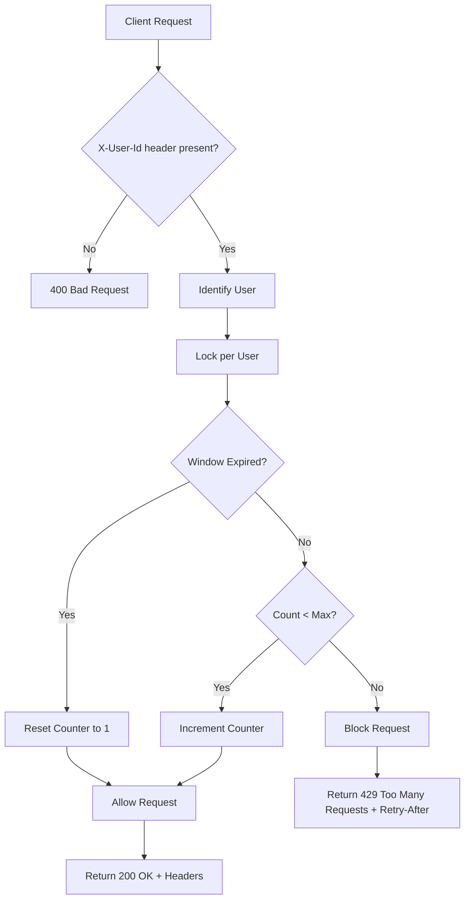

# OpenSpec — FastAPI Rate Limit Simulation

This project implements a simple REST API in FastAPI to demonstrate a **user-based rate limiting** mechanism.
It uses an in-memory storage to limit requests to 100 per minute per user.

## Architecture & Design

The rate limiter is implemented as a reusable FastAPI `Dependency` that checks an `InMemoryRateLimitStorage` before allowing access to the protected endpoint. 
It uses a Fixed Window algorithm to compute the limit. Access to the state is protected using `asyncio.Lock` per user.

### Flow Diagram



### Components:
- **RateLimiter**: Core logic that computes if a request is allowed based on the `RateLimitState`.
- **RateLimitStorage**: Abstraction (`Protocol`) for storing the state.
- **InMemoryRateLimitStorage**: In-memory implementation of the storage using a Python `dict`.

### Known Limitations
1. **In-memory storage**: The application state is stored in memory. Restarting the application resets all counters.
2. **Single worker only**: Multiple processes/workers do not share the same state. This version should run with a single worker.
3. **Fixed Window**: The algorithm allows a burst of requests near the window change.

## Project Structure

```text
api_rate_limit/
│
├── app/
│   ├── api/
│   │   └── v1/
│   │       └── resource.py
│   ├── core/
│   │   └── config.py
│   ├── rate_limit/
│   │   ├── dependency.py
│   │   ├── exceptions.py
│   │   ├── limiter.py
│   │   ├── models.py
│   │   └── storage.py
│   └── main.py
│
├── tests/
│   ├── api/
│   │   └── test_rate_limit.py
│   └── unit/
│       └── test_rate_limiter.py
│
├── docker-compose.yml
├── Dockerfile
├── pyproject.toml
└── README.md
```

## Getting Started

### Local Development (Poetry)
```bash
poetry install
poetry run uvicorn app.main:app --reload
```

### Docker
```bash
docker compose up -d --build
```

To stop the API:
```bash
docker compose down
```

The API will be available at `http://localhost:8000/docs`.